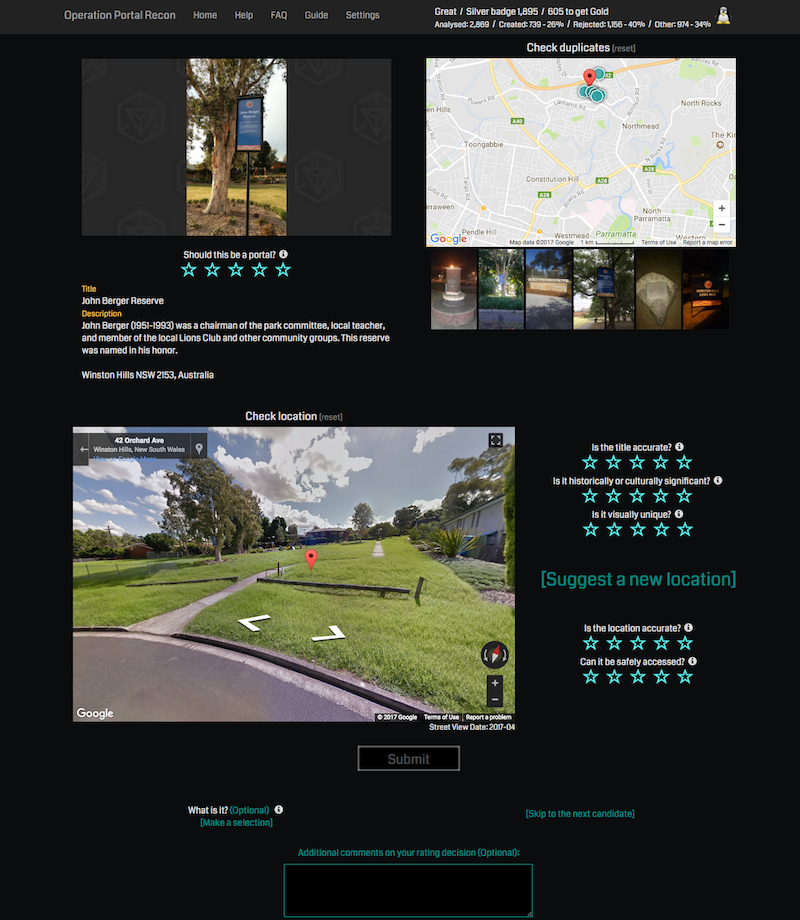

# cake-opr

* [Description](#description)
* [Features](#features)
* [Usage](#usage)
* [Example](#example)

## Description

KISS - Keep It Simple Stupid!

There's many of these user scripts for Ingress OPR (https://opr.ingress.com/recon) out there. I just wanted to create something simple to fix a few UX annoyances of mine though, not something that adds a ton of new buttons and links making the interface even busier.

## Features
See change history [here](changes.md)

* Move sections around:
  * Duplicates section to the top of page
  * Portal details to below the image
  * All the ratings except the main portal rating listed together
  * Wider Google streetview/maps view
  * What is it selector and comments side by side at the bottom
* Show user stats in top bar all the time
* Disable auto scroll when clicking on ratings
* Add links to full size images on main portal image and duplicates

## Usage

Use this URL to load it in to Tampermonkey or Greasemonkey:

https://raw.githubusercontent.com/cake-ingress/cake-opr/master/cake-opr.user.js

## Example

